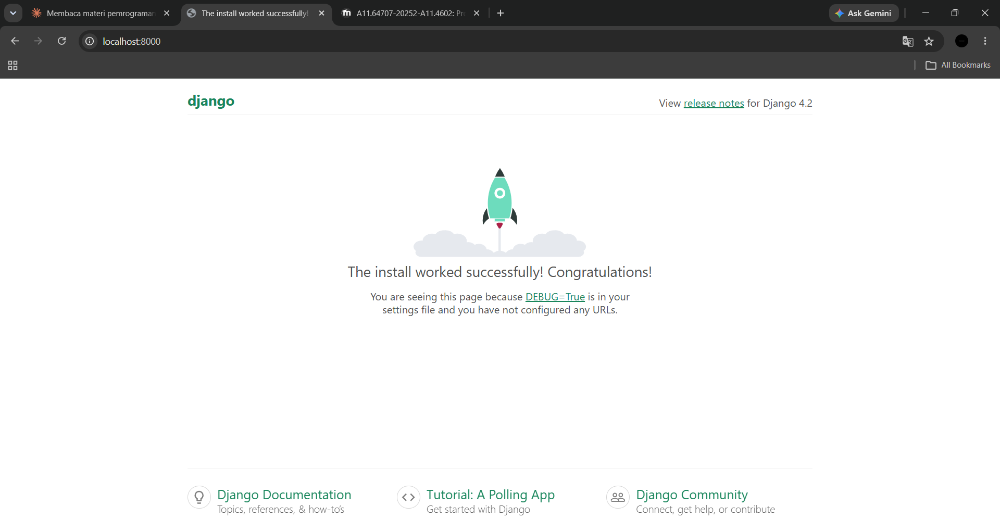
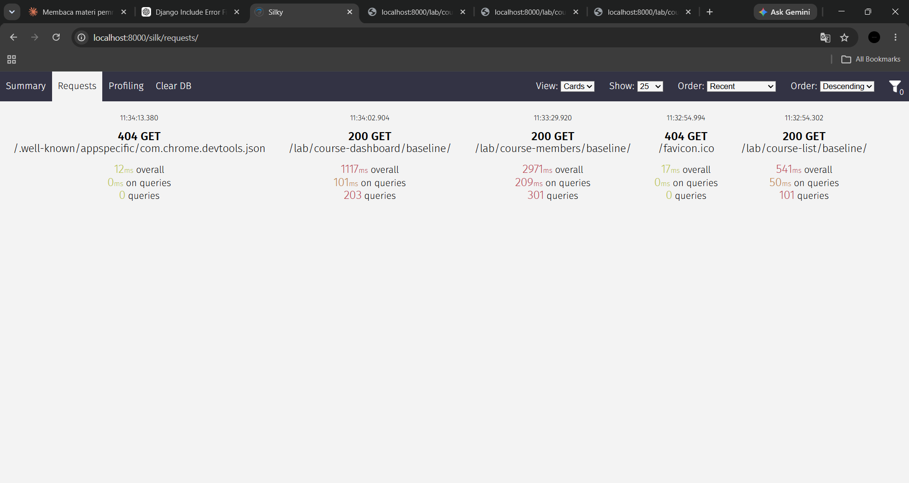
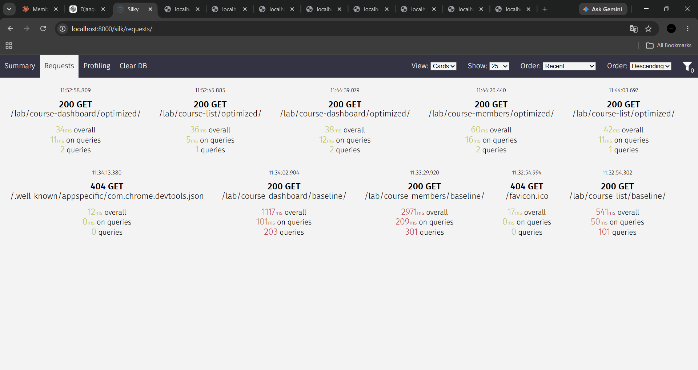
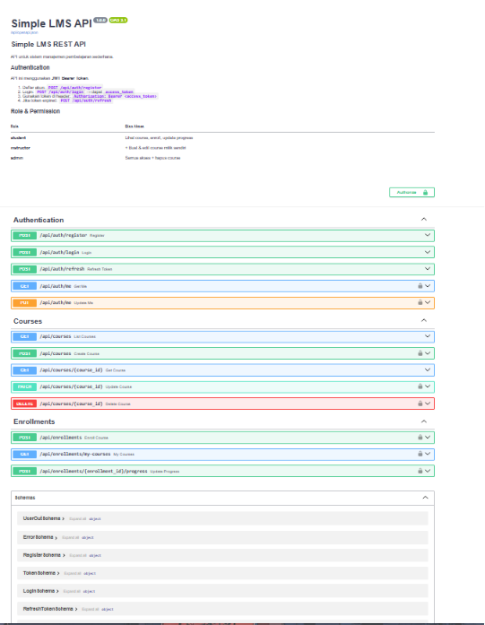

# Simple LMS — Backend Setup

**Nama:** Muhammad Ibadullah  
**NIM:** A11.2023.15275  
**Mata Kuliah:** Pemrograman Sisi Server  
**Universitas:** Dian Nuswantoro  

---

## Deskripsi

Setup environment development Django untuk Simple Learning Management System menggunakan Docker dan PostgreSQL, dilengkapi dengan data model LMS, query optimization menggunakan Django Silk profiling, REST API dengan Django Ninja, dan JWT Authentication & Authorization.

## Tech Stack

| Teknologi | Versi | Fungsi |
|---|---|---|
| Python | 3.11 | Bahasa pemrograman |
| Django | 4.2.9 | Web framework |
| PostgreSQL | 15 | Database |
| Docker | Latest | Containerization |
| Docker Compose | v2 | Multi-container orchestration |
| Pillow | 10.2.0 | Image field support |
| django-silk | 5.0.3 | Query profiling & benchmarking |
| django-ninja | 1.1.0 | REST API framework (Pydantic-based) |
| PyJWT | 2.8.0 | JWT token generation & validation |
| passlib[bcrypt] | 1.7.4 | Password hashing |
| email-validator | 2.1.1 | Validasi format email di Pydantic |

## Struktur Project

```
simple-lms/
├── docker-compose.yml        # Konfigurasi multi-container
├── Dockerfile                # Build image Django
├── .env.example              # Template environment variables
├── requirements.txt          # Python dependencies
├── manage.py                 # Django CLI tool
├── postman_collection.json   # Postman collection untuk testing API
├── config/
│   ├── settings.py           # Konfigurasi Django + Silk + JWT
│   ├── urls.py               # URL routing (/admin, /silk/, /api/)
│   └── wsgi.py               # WSGI entry point
├── courses/                  # App data model LMS
│   ├── models.py             # Data models (User, Course, Lesson, dll)
│   ├── managers.py           # Custom QuerySet & Manager
│   ├── admin.py              # Konfigurasi Django Admin
│   ├── views.py              # Endpoint baseline & optimized (Lab 5)
│   ├── urls.py               # Route endpoint lab
│   └── migrations/           # File migrasi database
├── api/                      # App REST API
│   ├── schemas.py            # Pydantic schemas (validasi input/output)
│   ├── auth.py               # JWT utilities + JWTAuth middleware
│   ├── permissions.py        # RBAC decorators (@is_instructor, dll)
│   ├── main.py               # NinjaAPI instance + router registration
│   └── routers/
│       ├── auth_router.py    # /api/auth/* endpoints
│       ├── course_router.py  # /api/courses/* endpoints
│       └── enrollment_router.py  # /api/enrollments/* endpoints
├── scripts/
│   ├── seed_data.py          # Script seed data awal
│   ├── seed_lab.py           # Script seed data skala besar (100+ course)
│   └── query_demo.py         # Demo N+1 problem & optimasi
└── fixtures/
    └── initial_data.json     # Data awal (hasil dumpdata)
```

---

## Progres 1 — Docker + Django + PostgreSQL Setup

Setup environment development Django dengan Docker Compose dan PostgreSQL sebagai database.

### Yang Dikerjakan

- Membuat `Dockerfile` untuk build image Django custom
- Konfigurasi `docker-compose.yml` dengan service `web` (Django) dan `db` (PostgreSQL)
- Setup `settings.py` dengan `python-decouple` untuk environment variables
- Konfigurasi koneksi PostgreSQL menggantikan SQLite default
- Static files configuration

### Screenshots

#### Django Welcome Page


---

## Progres 2 — Django ORM & Data Models

Implementasi data model untuk Simple LMS menggunakan Django ORM dengan relasi yang tepat dan optimasi query.

### Data Models

#### ERD

```
User (role: admin/instructor/student)
 │
 ├──[FK instructor]── Course ──[FK category]── Category (self-referencing)
 │                      │
 │                 ──[FK course]── Lesson (dengan field order)
 │
 └──[FK student, via Enrollment]── Course
              │
         Enrollment (unique: student+course)
              │
         Progress (tracking per-lesson)
```

#### Daftar Model

| Model | Deskripsi |
|---|---|
| `User` | Custom user extends AbstractUser, role: admin/instructor/student |
| `Category` | Kategori course dengan self-referencing FK untuk hierarki |
| `Course` | Course/mata kuliah dengan instructor, category, level, price |
| `Lesson` | Pelajaran dalam course, field `order` untuk urutan tampil |
| `Enrollment` | Pendaftaran siswa ke course, `unique_together` (student+course) |
| `Progress` | Tracking penyelesaian lesson per enrollment |

### Custom Managers

| Manager | Method | Fungsi |
|---|---|---|
| `CourseManager` | `.for_listing()` | Course list dioptimasi: `select_related` + `annotate` |
| `CourseManager` | `.published()` | Filter hanya course `is_published=True` |
| `EnrollmentManager` | `.for_student_dashboard(student)` | Dashboard siswa dengan `prefetch_related` progress |

### Database Indexes

| Index | Model | Kolom | Alasan |
|---|---|---|---|
| `idx_course_slug` | Course | `slug` | Lookup by slug di URL routing |
| `idx_course_pub_date` | Course | `is_published, -created_at` | Filter published + sort terbaru |
| `idx_course_price` | Course | `price` | Filter/sort harga di dashboard |
| `idx_course_inst_pub` | Course | `instructor, is_published` | Dashboard dosen: course published milik instructor X |
| `idx_course_level` | Course | `level` | Filter berdasarkan level |
| `idx_enroll_student_status` | Enrollment | `student, status` | Dashboard siswa: enrollment aktif |
| `idx_enroll_course_status` | Enrollment | `course, status` | Statistik enrollment per course |

---

## Progres 3 (Lab 5) — Optimasi Database dengan Django Silk

Profiling dan optimasi 3 endpoint menggunakan Django Silk. Membuktikan N+1 problem dan solusinya secara terukur.

### Endpoint Lab

| Endpoint | Deskripsi |
|---|---|
| `GET /lab/course-list/baseline/` | Daftar course + instructor — belum dioptimasi |
| `GET /lab/course-list/optimized/` | Daftar course + instructor — `select_related` |
| `GET /lab/course-members/baseline/` | Course + members + lessons — belum dioptimasi |
| `GET /lab/course-members/optimized/` | Course + members + lessons — `prefetch_related` + `annotate` |
| `GET /lab/course-dashboard/baseline/` | Statistik dashboard — belum dioptimasi |
| `GET /lab/course-dashboard/optimized/` | Statistik dashboard — `aggregate` + `annotate` |
| `GET /silk/` | Dashboard profiling Django Silk |

### Hasil Perbandingan Silk

Data diukur langsung dari Django Silk dengan dataset 100+ courses.

| Kasus | Endpoint Baseline | Endpoint Optimized | Query Baseline | Query Optimized | Waktu Baseline | Waktu Optimized | Query Improvement | Waktu Improvement | Teknik |
|---|---|---|---|---|---|---|---|---|---|
| Course + Teacher | `/lab/course-list/baseline/` | `/lab/course-list/optimized/` | **101 queries** | **1 query** | 541ms | 39ms | **99%** | **93%** | `select_related` |
| Course + Members + Lessons | `/lab/course-members/baseline/` | `/lab/course-members/optimized/` | **301 queries** | **2 queries** | 2971ms | 60ms | **99%** | **98%** | `prefetch_related` + `annotate` |
| Statistik Dashboard | `/lab/course-dashboard/baseline/` | `/lab/course-dashboard/optimized/` | **203 queries** | **2 queries** | 1117ms | 36ms | **99%** | **97%** | `aggregate` + `annotate` |

> ✅ Semua endpoint optimized mencapai improvement **≥ 99%** (jauh melampaui target minimum 50%).

### Analisis N+1 Problem

#### Skenario 1 — Course List + Teacher (101 queries)
```
Baseline:  1 query (SELECT course) + 100 query (SELECT user WHERE id=?) = 101 queries
Optimized: 1 query JOIN (SELECT course.* INNER JOIN lms_user) = 1 query
```

#### Skenario 2 — Course + Members + Lessons (301 queries)
```
Baseline:  1 + 100 (instructor) + 100 (enrollment count) + 100 (lessons) = 301 queries
Optimized: 1 query (course+instructor JOIN) + 1 query (lessons prefetch) = 2 queries
```

#### Skenario 3 — Statistik Dashboard (203 queries)
```
Baseline:  1 + 100 (enrollment count loop) + 100 (instructor loop) + beberapa stats = 203 queries
Optimized: 1 query aggregate() + 1 query annotate() = 2 queries
```

### Teknik Optimasi yang Digunakan

| Teknik | Kapan Dipakai | Contoh |
|---|---|---|
| `select_related` | ForeignKey (many-to-one) | `Course → instructor` |
| `prefetch_related` | Reverse FK / ManyToMany | `Course → lessons` |
| `annotate(Count)` | Hitung relasi di database | Jumlah enrollment per course |
| `aggregate()` | Statistik global | MAX, MIN, AVG, COUNT sekaligus |
| `bulk_create` | Insert banyak record | Seed 100 course dalam 1 query |
| `QuerySet.update(F())` | Update massal | Naikkan harga semua course |

### Screenshots Lab 5

#### Silk — Baseline Requests


#### Silk — Optimized Requests (Perbandingan)


---

## Progres 4 — REST API & Authentication System

Membangun REST API lengkap menggunakan Django Ninja dengan JWT authentication dan role-based authorization.

### Arsitektur API

```
Client (Browser / Postman)
        │
        ▼  Authorization: Bearer <access_token>
┌───────────────────────────────────────┐
│          Django Ninja API             │
│  /api/docs  ← Swagger UI             │
│                                       │
│  JWTAuth → decode token → get user   │
│  @is_instructor / @is_admin / RBAC   │
│                                       │
│  /api/auth/*        Auth endpoints   │
│  /api/courses/*     Course CRUD      │
│  /api/enrollments/* Enrollment       │
└───────────────────────────────────────┘
        │
        ▼
  PostgreSQL Database
```

### Alur JWT Authentication

```
1. POST /api/auth/login  →  { access_token, refresh_token }
2. Simpan token di client
3. Setiap request: Authorization: Bearer <access_token>
4. access_token expired (1 jam) → POST /api/auth/refresh
5. Dapat access_token baru, refresh_token berlaku 7 hari
```

### Daftar Endpoint API

#### Authentication (`/api/auth/`)

| Method | Endpoint | Auth | Deskripsi |
|---|---|---|---|
| POST | `/api/auth/register` | ❌ | Daftar user baru (student/instructor) |
| POST | `/api/auth/login` | ❌ | Login → dapat JWT tokens |
| POST | `/api/auth/refresh` | ❌ | Refresh access token |
| GET | `/api/auth/me` | ✅ | Ambil profil user login |
| PUT | `/api/auth/me` | ✅ | Update profil |

#### Courses — Public (`/api/courses/`)

| Method | Endpoint | Auth | Deskripsi |
|---|---|---|---|
| GET | `/api/courses` | ❌ | List course (pagination + filter + search) |
| GET | `/api/courses/{id}` | ❌ | Detail course + daftar lesson |

#### Courses — Protected

| Method | Endpoint | Auth | Role | Deskripsi |
|---|---|---|---|---|
| POST | `/api/courses` | ✅ | instructor | Buat course baru |
| PATCH | `/api/courses/{id}` | ✅ | owner/admin | Update course |
| DELETE | `/api/courses/{id}` | ✅ | admin | Hapus course |

#### Enrollments (`/api/enrollments/`)

| Method | Endpoint | Auth | Role | Deskripsi |
|---|---|---|---|---|
| POST | `/api/enrollments` | ✅ | student | Daftar ke course |
| GET | `/api/enrollments/my-courses` | ✅ | semua | Daftar course + progress |
| POST | `/api/enrollments/{id}/progress` | ✅ | semua | Tandai lesson selesai |

### Role-Based Access Control (RBAC)

| Role | Hak Akses |
|---|---|
| `student` | Lihat course publik, enroll, update progress sendiri |
| `instructor` | + Buat course, edit course milik sendiri |
| `admin` | Semua akses + hapus course manapun |

Implementasi menggunakan decorator:
```python
@is_instructor   # Hanya instructor/admin
@is_student      # Hanya student/admin  
@is_admin        # Hanya admin
@is_course_owner # Instructor pemilik course atau admin
```

### Pydantic Schemas (Validasi Otomatis)

| Schema | Dipakai di | Validasi |
|---|---|---|
| `RegisterSchema` | POST /register | username min 3 char, password match, role valid |
| `LoginSchema` | POST /login | username + password |
| `TokenSchema` | Response login/refresh | access_token, refresh_token, expires_in |
| `CourseCreateSchema` | POST /courses | title tidak kosong, level valid, price ≥ 0 |
| `CourseListSchema` | GET /courses | pagination: items, total, page, total_pages |
| `EnrollmentDetailSchema` | GET /my-courses | progress list, completion_percentage |

### Screenshots

#### Swagger UI — API Documentation


---

## Prerequisites

- Docker Desktop terinstall dan berjalan
- Port 8000 tidak digunakan aplikasi lain

## Cara Menjalankan

### 1. Clone Repository

```bash
git clone [URL_REPO_KAMU]
cd simple-lms
```

### 2. Setup Environment Variables

```bash
cp .env.example .env
# Edit .env — pastikan isi JWT_SECRET_KEY
```

### 3. Jalankan Docker Compose

```bash
docker compose up -d
```

### 4. Jalankan Migrasi Database

```bash
docker compose exec web python manage.py makemigrations courses
docker compose exec web python manage.py migrate
```

### 5. Buat Superuser

```bash
docker compose exec web python manage.py createsuperuser
```

### 6. Seed Data Awal

```bash
# Seed data standar
docker compose exec web python scripts/seed_data.py

# Seed data skala besar untuk Lab 5 (100+ courses)
docker compose exec web python scripts/seed_lab.py
```

### 7. Buka di Browser

| URL | Deskripsi |
|---|---|
| `http://localhost:8000/admin` | Django Admin |
| `http://localhost:8000/api/docs` | Swagger UI — REST API Documentation |
| `http://localhost:8000/silk/` | Django Silk profiling dashboard |
| `http://localhost:8000/lab/course-list/baseline/` | Endpoint baseline skenario 1 |
| `http://localhost:8000/lab/course-list/optimized/` | Endpoint optimized skenario 1 |
| `http://localhost:8000/lab/course-members/baseline/` | Endpoint baseline skenario 2 |
| `http://localhost:8000/lab/course-members/optimized/` | Endpoint optimized skenario 2 |
| `http://localhost:8000/lab/course-dashboard/baseline/` | Endpoint baseline skenario 3 |
| `http://localhost:8000/lab/course-dashboard/optimized/` | Endpoint optimized skenario 3 |

### Perintah Berguna

```bash
# Lihat status container
docker compose ps

# Lihat logs
docker compose logs -f web

# Masuk ke shell Django
docker compose exec web python manage.py shell

# Jalankan demo query optimization
docker compose exec web python scripts/query_demo.py

# Export data ke fixture
docker compose exec web python manage.py dumpdata courses --indent 2 -o fixtures/initial_data.json

# Stop semua service
docker compose down

# Stop dan hapus data (HATI-HATI!)
docker compose down -v
```

## Environment Variables

| Variabel | Fungsi | Contoh |
|---|---|---|
| `SECRET_KEY` | Kunci enkripsi Django | string acak panjang |
| `DEBUG` | Mode debug | `True` (dev) / `False` (prod) |
| `ALLOWED_HOSTS` | Host yang diizinkan | `localhost,127.0.0.1` |
| `DB_NAME` | Nama database PostgreSQL | `lms_db` |
| `DB_USER` | Username database | `lms_user` |
| `DB_PASSWORD` | Password database | string kuat |
| `DB_HOST` | Hostname database | `db` (nama service Docker) |
| `DB_PORT` | Port database | `5432` |
| `JWT_SECRET_KEY` | Secret key untuk signing JWT token | string acak panjang |

---

*Pemrograman Sisi Server — Universitas Dian Nuswantoro*